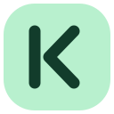
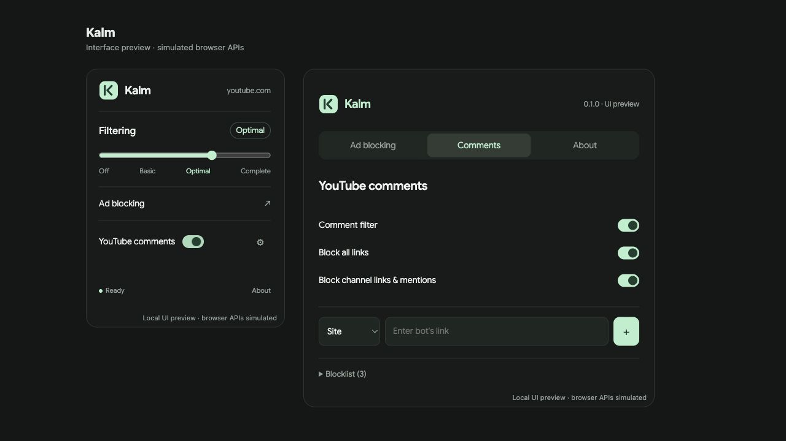

# Kalm

A quieter web. Ad blocking and YouTube comment screening, with simple controls.

**0.1.0 is a development preview.** Packages and automated checks are available
for Chromium, Firefox and Safari. Live Firefox/Safari verification and store
signing are pending; do not describe this release as fully tested in those browsers.



- A four-position slider: Off, Basic, Optimal, Complete. The toolbar slider
  applies to the current website; setup also has a default for other websites.
- Create a persistent element filter, or remove an element for the current page.
- Optional request counts in browsers that expose the native badge API.
- Screen YouTube comments before revealing them, including later batches/replies.
- Optional all-links blocking and literal word/phrase blocking.
- One shared list for bot domains and keywords, collapsed by default.
- Author bios and visible channel promotion shelves are screened with bounded
  concurrency and a 24-hour decision cache. External links, linked profiles
  and avatars are not fetched for screening.
- Local settings, bundled fonts, no analytics, account or Kalm server.

[Download preview builds](https://github.com/userduser/kalm/releases) ·
[Install](docs/INSTALL.md) · [Validation status](docs/TESTING.md) ·
[Changelog](CHANGELOG.md) · [Privacy](docs/PRIVACY.md)

## Browser support

| Browser         | Minimum | Preview installation                                        |
| --------------- | ------- | ----------------------------------------------------------- |
| Chromium        | 122     | Load unpacked extension folder                              |
| Firefox desktop | 140     | Load Temporary Add-on; permanent distribution needs signing |
| Safari on macOS | 18.6    | Add Temporary Extension from folder or ZIP                  |

Safari supports the native element picker, cosmetic custom filters and built-in
lists. It cannot compile arbitrary imported/network filter lists through the
offscreen API. Badge controls are enabled only when the browser reports support.
The project uses a Manifest V3 engine; classic dynamic firewall rules are outside
this engine's capabilities. iOS/Android have not been tested.

## Build and test

Node 22.13+ (24 recommended), Git, `unzip` and `zip`; macOS or Linux.

```sh
git clone https://github.com/userduser/kalm.git
cd kalm
npm ci
npm run check
```

Builds appear in `dist/{chromium,firefox,safari}` and ZIPs in `dist/`.
There are **no npm runtime dependencies in the extension**. Development tools are
Mozilla's add-on validator and Prettier. Building alone needs no npm installation:
`node tools/build.mjs`. Official engine packages are downloaded once, checked
against committed SHA-256 hashes and reused from `.cache/upstream`.

```sh
npm run demo           # Local UI adapter and comment lifecycle fixture on :8770
npm run build:safari   # Optional macOS host build; requires Xcode
git submodule update --init --recursive  # Needed for source releases / engine work
npm run source         # Complete source bundle; run after committing changes
npm run verify:source  # Rebuild extracted source offline and compare packages
```

The source release includes the exact cached engine packages, upstream and nested
library sources, and overlay build scripts. `node tools/build.mjs` can rebuild it
offline. Building from scratch and downloading filter-list updates are separate
tasks; [maintainer instructions](docs/MAINTAINING.md) explain engine upgrades.

## Small overlay, maintained engine

```text
src/comments/       YouTube body checks, profile cache, visibility gate and bridge
src/ui/             Compact popup/setup, API adapter, logo and bundled font
tools/              Pinned builds, source bundle, Safari converter and local demo
test/               Comment regressions, startup bridges and package/API checks
third_party/engine/ Pinned upstream source, kept separate from Kalm changes
docs/               Installation, privacy, verification and maintenance
```

The engine and list data account for nearly all of the approximately 9.7 MB
download. Kalm adds a small interface and comment filter rather than a second
blocking engine or a background polling service. Profile checks still add latency
for uncached authors; comments remain hidden when a profile cannot be verified.

## Support Kalm

[Donate to protect kids and older adults](https://kalm-support.pages.dev/).
Optional contributions support Kalm's development and maintenance. All features
remain free. The support site and Stripe checkout are separate from this repository;
the extension only opens a link and does not handle payments or payment details.

## License and credits

GPL-3.0-or-later; see [LICENSE](LICENSE), [NOTICE](NOTICE) and
[third-party notices](THIRD_PARTY_NOTICES.md). The ad-blocking engine is
[uBlock Origin Lite](https://github.com/uBlockOrigin/uBOL-home), by Raymond Hill
and contributors. Kalm is an independent derivative. Original source notices,
library licenses and filter-list metadata are preserved. Google Sans is bundled
under the SIL Open Font License. The logo is original vector artwork.

The Git history starts with the working comment-filter 0.7.0 snapshot. That earlier
project had no Git repository; subsequent Kalm changes are recorded in real,
separate commits. Upstream history remains available through the pinned submodule
and its original repositories.
